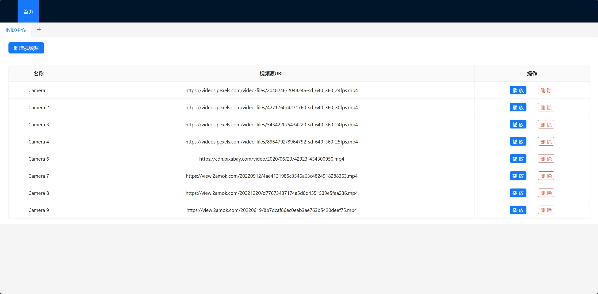
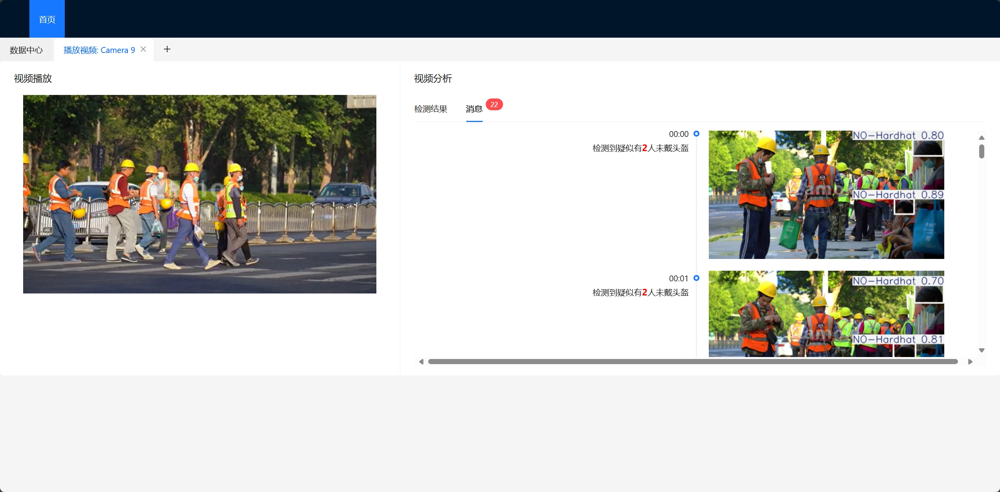

# 🏗️SiteSafetyVision⛑️

## Description

👷‍♂️SiteSafetyVision👷 is a real-time video analysis tool designed to enhance safety compliance on construction sites. It utilizes advanced machine learning models (based on YOLOv8) to detect workers not wearing safety helmets and provides instant alerts to ensure workplace safety. The system is capable of analyzing live video streams, identifying potential safety violations, and documenting them with timestamps and images.



## Features

- **Real-time Video Monitoring:** Analyze live video streams to detect safety compliance issues.
- **Helmet Detection:** Accurately identifies workers who are not wearing safety helmets.
- **Instant Alerts:** Provides real-time alerts when safety violations are detected.
- **Detailed Timeline:** Displays a timeline with images and timestamps of detected violations.
- **Interactive Video Controls:** Allows users to click on detected events to seek directly to the corresponding time in the video.
- **Expanded Detection Capabilities:** The YOLOv8 model is not limited to detecting people and safety helmets; it can also recognize masks😷, safety vests🦺, safety cones🚧, machinery🚜(e.g., excavators), and vehicles🚗.

## Folder Structure
```
.
├───images
├───py_back
├───site-safety_back
├───site-safety_front
└───README.md
```

## Installation

1. Clone the repository:

	```bash
	git clone git@github.com:SamSz04/SiteSafetyVision.git
	```

2. Navigate to the project directory:

	```bash
	cd SiteSafetyVision
	```

3. Set up the database:

	- Import the provided SQL script  into your MySQL database.

		````sql
		create table video_source
		(
		    id   int auto_increment
		        primary key,
		    name varchar(255) not null,
		    url  varchar(255) not null
		);
		````

	- Update the database connection details in the Java backend configuration file (`application.properties`).

4. Run the Java backend server

5. Start the FastAPI server:

	```bash
	uvicorn main:app --host 0.0.0.0 --port 5000
	```

6. Open the frontend (React) in your browser:

	- Install the required packages:

		```bash
		npm install
		```

	- Start the React development server:

		```bash
		npm start
		```

	- Visit `http://localhost:3000` in your web browser.

## Usage



1. Access the application through your web browser at `http://localhost:3000`.
2. Add video sources via the "新增视频源" button.
3. Click the "播放" button next to a video source to start analyzing the video stream.
4. View detection results in real-time through the timeline provided in the analysis tab.
	- Click on the timestamps in the timeline to seek directly to that time in the video.
	- The number of workers detected without helmets is displayed along with the timestamp.

## API Endpoints

- **`/ws`**: WebSocket endpoint for streaming video analysis data.
	- Sends detected events, including timestamps, images, and the number of workers without helmets.

